**Screenshots**

### SSH Key Setup
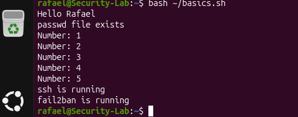

### PowerShell Remote Connection
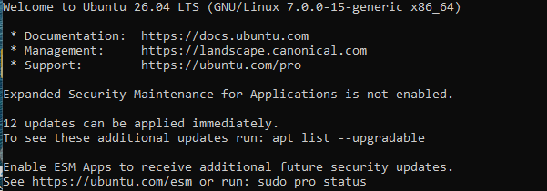

### Passwordless Login
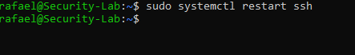

### SSH Activity Logs
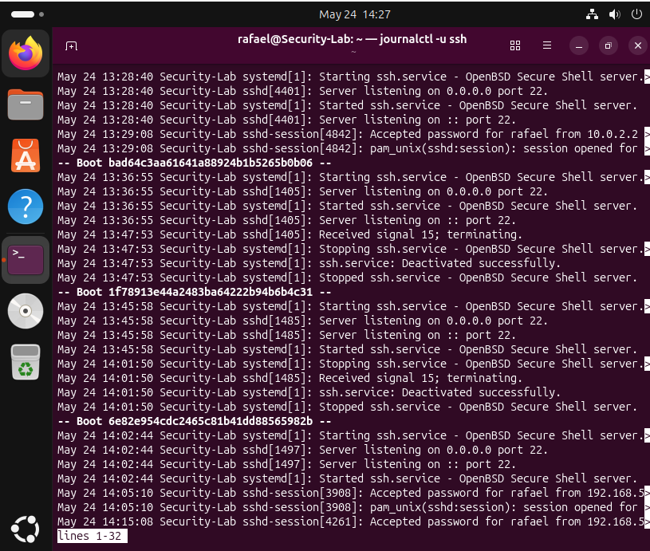

### Root Login Blocked
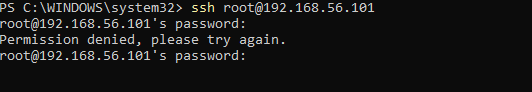

### Hardened sshd_config
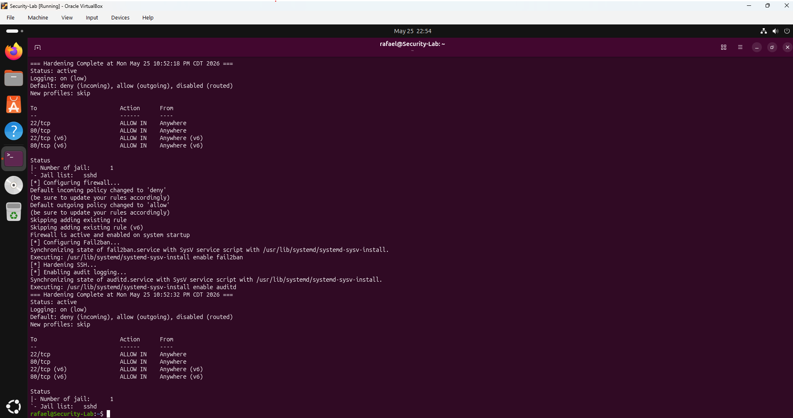

---

## Networking

Explored network configuration, DNS resolution, port scanning, and live traffic capture.

**What I Did**
- Checked IP addressing and routing tables
- Performed DNS lookups using nslookup and dig
- Scanned open ports and services with Nmap
- Captured and filtered live network traffic with Wireshark

**Screenshots**

### DNS Records — dig google.com
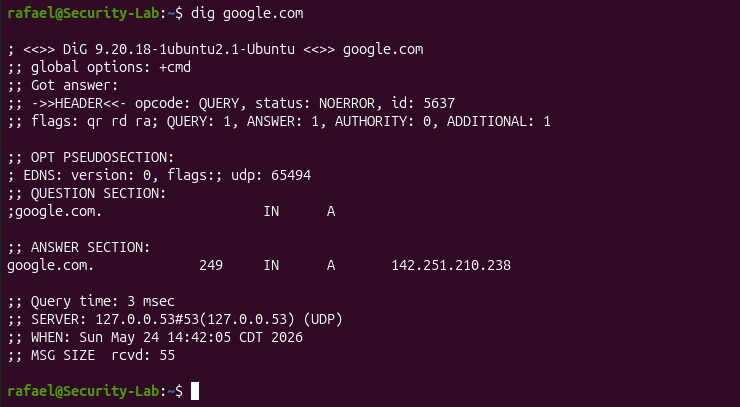

### Traceroute — Hops to Google
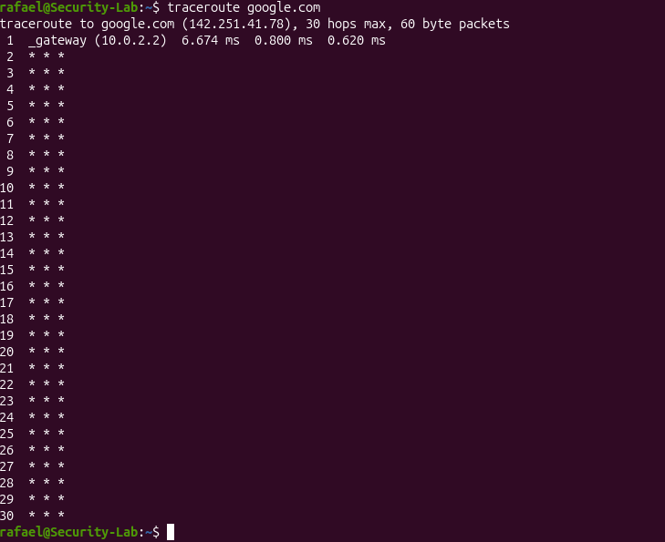

### Nmap — Open Ports and Services
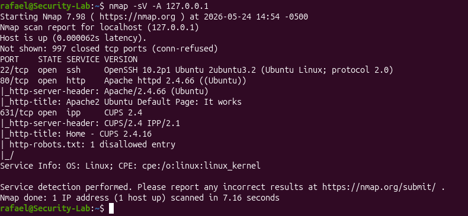

### Port 80 Open — Apache Running

### Port 200 Open
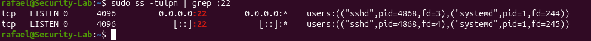

### curl and ps Output
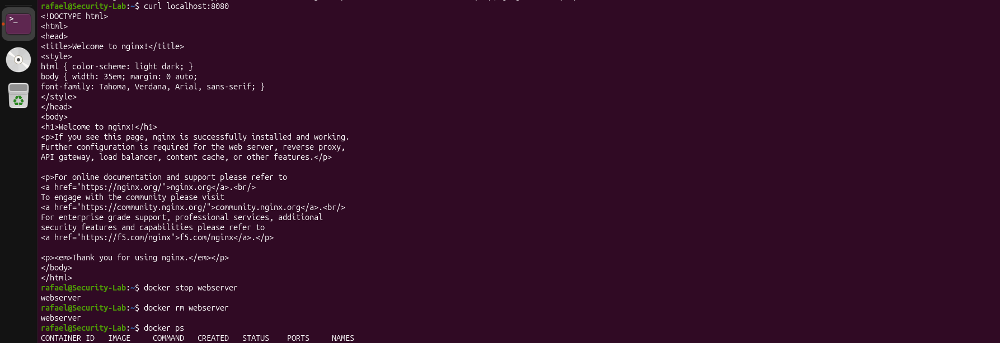

### Wireshark — DNS Traffic

### Wireshark — ICMP Traffic
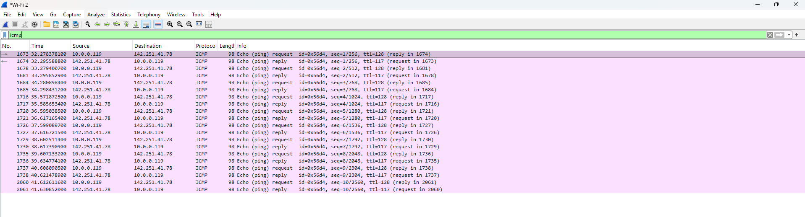

---

## Firewall

Configured ufw and iptables to control inbound and outbound network traffic.

**What I Did**
- Set default deny on all incoming traffic
- Allowed only SSH (port 22) and HTTP (port 80)
- Added and removed custom iptables rules
- Verified active rules with ufw status and iptables -L

**Screenshots**

### ufw Active Rules
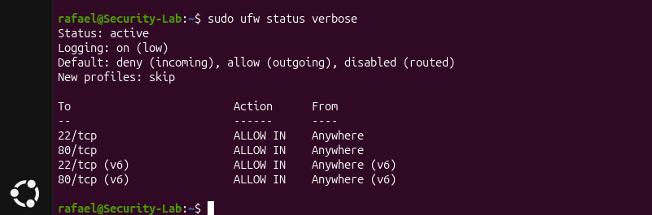

### iptables Rules
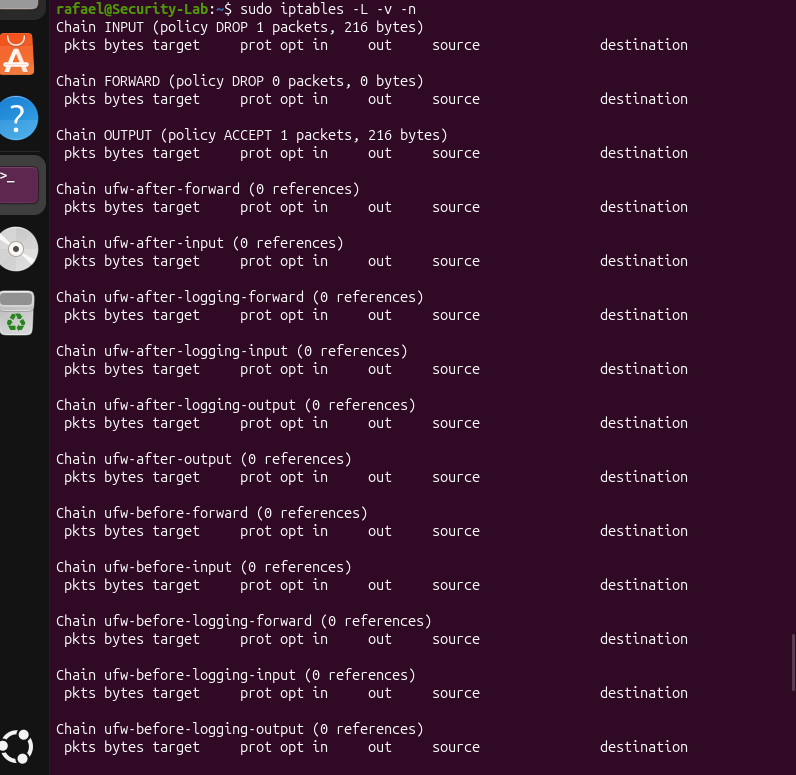

---

## Audit Logging

Configured auditd to monitor critical system files and analyzed authentication logs.

**What I Did**
- Installed and enabled auditd
- Set watches on /etc/passwd and /etc/shadow
- Triggered audit events by adding a test user
- Searched audit logs with ausearch
- Analyzed auth.log for failed login attempts and suspicious IPs

**Screenshots**

### Audit Event Triggered
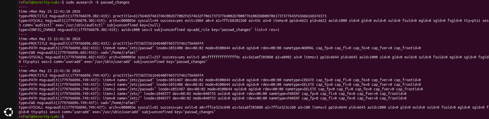

### Failed Login Attempts

### Failed IPs
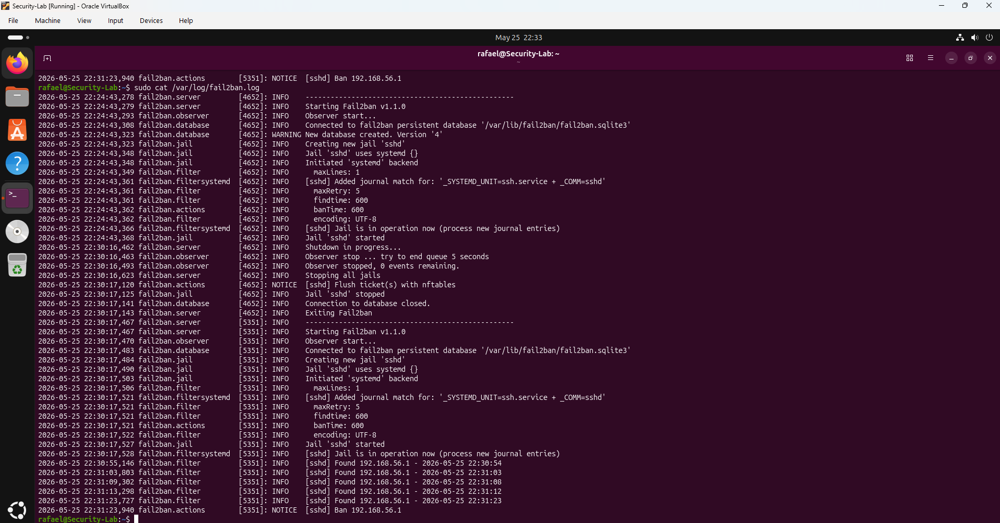

---

## Scripting

Built Bash and Python scripts to automate security tasks and monitor system activity.

**What I Did**
- Wrote a Bash hardening script that configures ufw, Fail2ban, and SSH automatically
- Built a Python auth monitor that reads /var/log/auth.log and reports system stats every 30 seconds
- Built a Python IP alert system that detects IPs exceeding a failed login threshold

**Screenshots**

### Bash Script Running
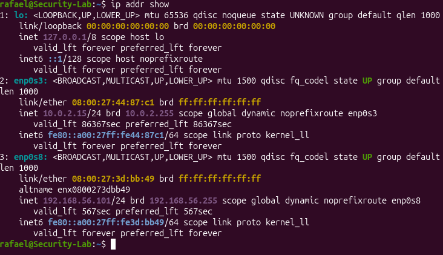

### Python Auth Monitor — Live Output
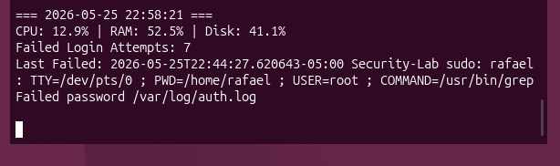

### Python IP Alert — Alert Firing
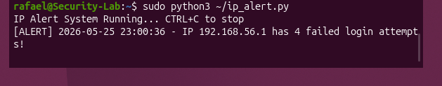

---

## Docker

Containerized the Python security monitor using Docker.

**What I Did**
- Installed Docker on Ubuntu 24.04
- Ran an Nginx container to verify Docker was working
- Built a custom Docker image for the Python auth monitor
- Mounted /var/log as read-only so the container could access live auth logs
- Verified the monitor was running inside the container using docker logs

**Screenshots**

### Python Script Running in Container

