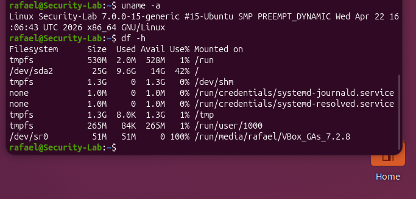
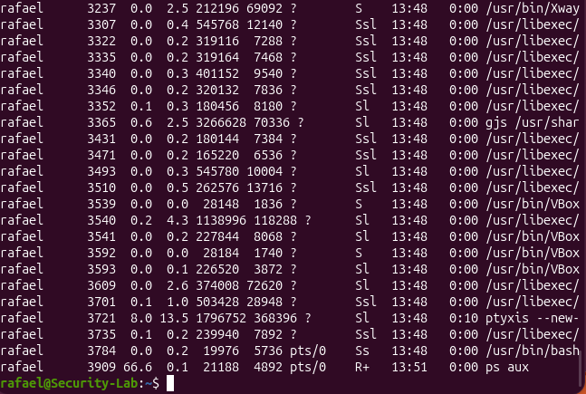
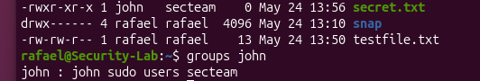
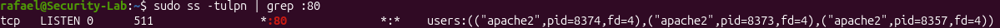

# Linux Security Lab

## Summary
This project documents a fully functional cybersecurity home lab built from scratch on Ubuntu 24.04 running inside VirtualBox. The goal was to simulate a real-world hardened Linux server environment and develop hands-on experience with the tools and techniques used by security engineers and SOC analysts every day.

Over the course of this lab I configured SSH key-based authentication, built firewall rules from the ground up, set up automated intrusion detection with Fail2ban, monitored system activity with auditd, wrote custom Bash and Python security tools, captured live network traffic with Wireshark, and containerized my monitoring tool using Docker. Everything was done manually through the terminal to build deep understanding of how each component works.

## Tools Used
- VirtualBox
- Ubuntu 24.04
- SSH / OpenSSH
- ufw / iptables
- Fail2ban
- auditd
- Nmap
- Wireshark
- Python 3
- Bash
- Docker
- Git

---

## Linux Fundamentals

### Summary
Before diving into security I got comfortable with the Linux environment itself. I learned how to navigate the filesystem, manage users and groups, and control file permissions — all foundational skills for any security role.

### What I Did
- Navigated the filesystem using core terminal commands (pwd, ls, cd, cat, cp, mv, rm)
- Monitored system resources with top, df, free, and uptime
- Created users and groups and managed group membership
- Modified file permissions and ownership using chmod and chown
- Verified running processes with ps aux

**Screenshots**

### Login Screen

### Desktop

### System Info — uname

### Running Processes — ps aux

### User Permissions and Groups

---

## SSH

### Summary
SSH is the primary way administrators access Linux servers remotely. I installed and configured OpenSSH, then hardened it using industry best practices — replacing password login with cryptographic key authentication and locking down the server config to reduce the attack surface.

### What I Did
- Installed OpenSSH server and confirmed the service was active
- Connected remotely from Windows PowerShell using password authentication
- Generated an ed25519 key pair on Windows and deployed the public key to the server
- Configured passwordless SSH login using authorized_keys
- Disabled root login, password authentication, and limited login attempts
- Restricted access to a single user with AllowUsers

**Hardening Settings Applied**
PermitRootLogin no
PasswordAuthentication no
MaxAuthTries 3
LoginGraceTime 20
AllowUsers rafael
X11Forwarding no

**Screenshots**

### SSH Key Setup

### PowerShell Remote Connection

### Passwordless Login

### SSH Activity Logs

### Root Login Blocked

### Hardened sshd_config

---

## Networking

### Summary
Understanding how data moves across a network is essential for any security role. I explored how my VM was addressed on the network, how DNS resolves domain names, what ports and services were exposed, and how to capture and analyze live traffic — the same skills used in network security monitoring.

### What I Did
- Checked IP addressing and routing tables with ip addr and ip route
- Performed DNS lookups using nslookup and dig
- Scanned open ports and running services with Nmap
- Traced packet routes across the internet with traceroute
- Captured and filtered live network traffic with Wireshark

**Screenshots**

### DNS Records — dig google.com

### Traceroute — Hops to Google

### Nmap — Open Ports and Services

### Port 80 Open — Apache Running

### Port 200 Open

### curl and ps Output

### Wireshark — DNS Traffic

### Wireshark — ICMP Traffic

---

## Firewall

### Summary
A firewall is the first line of defense for any server. I configured both ufw for simplified rule management and iptables for low-level traffic control — blocking all unwanted inbound connections while allowing only the services I explicitly permitted.

### What I Did
- Set default deny on all incoming traffic with ufw
- Allowed only SSH (port 22) and HTTP (port 80)
- Added and removed custom iptables rules manually
- Verified all active rules with ufw status verbose and iptables -L

**Screenshots**

### ufw Active Rules

### iptables Rules

---

## Audit Logging

### Summary
Audit logging is how security teams detect unauthorized changes on a system. I configured auditd to watch critical system files and analyzed authentication logs to identify failed login attempts — the same techniques used in real incident response.

### What I Did
- Installed and enabled auditd
- Set watches on /etc/passwd and /etc/shadow to detect unauthorized modifications
- Triggered audit events by adding a test user and confirmed they were captured
- Searched audit logs with ausearch and generated reports with aureport
- Analyzed auth.log to identify failed login attempts and suspicious source IPs

**Screenshots**

### Audit Event Triggered

### Failed Login Attempts

### Failed IPs

---

## Scripting

### Summary
Manual monitoring does not scale — security engineers automate everything they can. I wrote a Bash script to harden a fresh server automatically, and two Python tools to monitor authentication logs and alert on suspicious IP behavior in real time.

### What I Did
- Wrote a Bash hardening script that installs and configures ufw, Fail2ban, and SSH in one run
- Built a Python auth monitor that reads /var/log/auth.log and reports CPU, RAM, disk, and failed login counts every 30 seconds
- Built a Python IP alert system that tracks failed login attempts per IP and fires an alert when a threshold is crossed — mimicking what real SIEM tools do

**Screenshots**

### Bash Script Running

### Python Auth Monitor — Live Output

### Python IP Alert — Alert Firing

---

## Docker

### Summary
Docker is used in virtually every modern tech environment to run applications in isolated, portable containers. I packaged my Python security monitor into a Docker image so it can be deployed on any server instantly — the same workflow used in production security tooling.

### What I Did
- Installed Docker on Ubuntu 24.04 and verified it with a hello-world container
- Ran an Nginx web server container to understand port mapping and container lifecycle
- Wrote a Dockerfile to package the Python auth monitor into a custom image
- Mounted /var/log as read-only so the container could access live system auth logs
- Verified the monitor was running correctly inside the container using docker logs

**Screenshots**

### Python Script Running in Container

